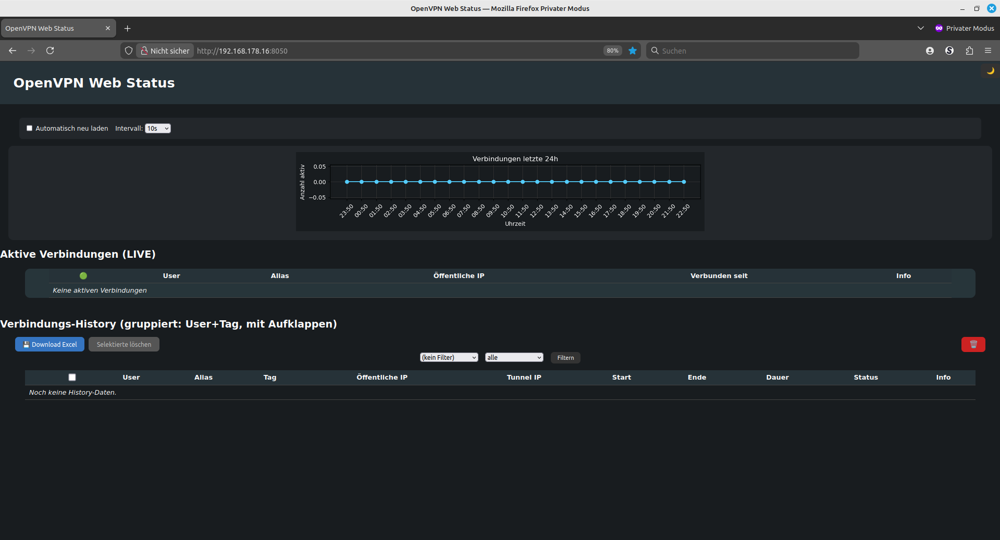
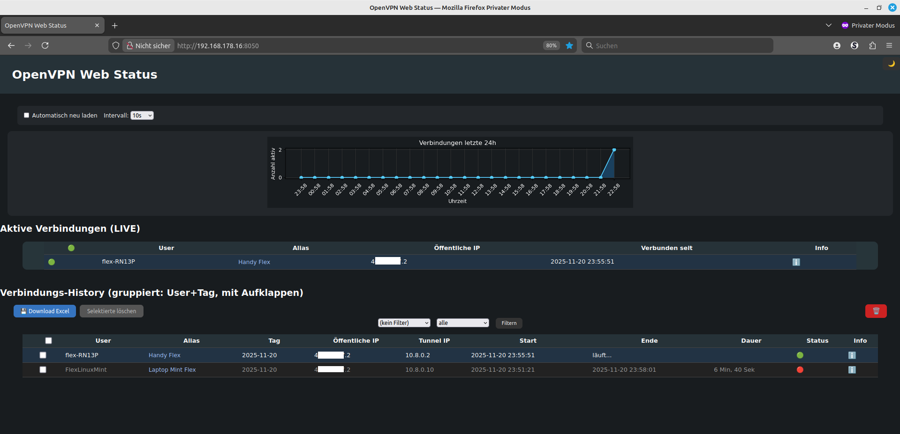

# OpenVPN&nbsp;Status&nbsp;Web

**OpenVPN&nbsp;Status&nbsp;Web** ist ein kleines Python‑Projekt, das den Status einer OpenVPN‑Installation protokolliert und eine komfortable Web‑Oberfläche zur Auswertung anbietet.  Das Projekt besteht aus zwei Skripten:

* **`vpn_session_history.py`** schreibt aus den aktuellen OpenVPN‑Statusinformationen ein CSV‑Log mit allen Sitzungen.  Es erkennt neue Verbindungen, setzt Endzeiten für bereits beendete Sitzungen und berechnet die Dauer in Sekunden.
* **`vpn_status_web.py`** ist eine Flask‑Anwendung, die das Log sowie den Live‑Status auf einer Webseite darstellt, einen 24‑Stunden‑Graphen erzeugt, nach Nutzer und Status filtert und Excel‑Exporte ermöglicht.

## Funktionsumfang

* **Protokollierung laufender und beendeter Verbindungen:** Das Skript `vpn_session_history.py` liest regelmäßig die vom OpenVPN‑Server erzeugte Status‑Datei (`openvpn‑status.log`). Für jeden Eintrag der `CLIENT_LIST` wird eine Sitzungs‑ID bestehend aus Benutzername und Startzeit generiert.  Bereits beendete Sitzungen erhalten eine Endzeit und eine berechnete Dauer.  Neue Verbindungen werden ergänzt. Das Ergebnis landet in einer CSV‑Datei (`openvpn‑sessions.csv`).

* **Web‑Dashboard mit Live‑Ansicht:** Die Flask‑Anwendung zeigt unter “Aktive Verbindungen (LIVE)” alle aktuell angemeldeten Nutzer.  Die Daten werden direkt aus der Status‑Datei gelesen und werden optional durch Aliasnamen ergänzt, die Sie in einer JSON‑Datei hinterlegen können.

* **Historische Verbindungen:** Die History wird gruppiert nach Benutzer und Tag dargestellt.  Jede Zeile zeigt den letzten Verbindungsversuch des Benutzers an diesem Tag; weitere Sessions desselben Tages lassen sich mit einem Pfeil aufklappen.  Es lässt sich zwischen „aktiv“, „beendet“ oder allen Einträgen filtern.

* **24‑Stunden‑Graph:** Die Anwendung generiert mit Matplotlib einen Balken‑/Linien‑Graphen, der die Anzahl aktiver Verbindungen über die letzten 24&nbsp;Stunden zeigt.  In der Web‑Oberfläche kann zwischen Hell‑ und Dunkelmodus umgeschaltet werden; der Graph passt sich automatisch an.

* **Excel‑Export:** Per Knopfdruck lässt sich die gefilterte History als `.xlsx` herunterladen.  Hierfür wird das Paket `openpyxl` verwendet.

* **Selektives Löschen:** Sie können einzelne Sitzungen direkt aus dem Web‑Interface löschen oder die komplette Historie zurücksetzen.  Aus Sicherheitsgründen sind Doppelt‑Bestätigungen eingebaut.

* **Aliasnamen für Benutzer:** Legen Sie optional eine JSON‑Datei `openvpn‑aliases.json` an, in der Sie OpenVPN‑Benutzernamen auf sprechende Namen (z.&nbsp;B. Realnamen oder Abteilung) abbilden.  Die Web‑Anwendung zeigt dann neben dem Benutzernamen den Alias an.

## Bildschirmfotos / Screenshots

Um einen ersten Eindruck von der Web‑Oberfläche zu vermitteln, finden Sie nachfolgend zwei exemplarische Bildschirmfotos.  Die Bilder befinden sich im Ordner `images` des Projekts.



*Deutsch:* Startseite des Dashboards ohne aktive Verbindungen. Man sieht den dunkelblauen Hintergrund, eine leere Statistik‑Grafik und den Hinweis „Keine aktiven Verbindungen“.  Im unteren Teil ist die History‑Tabelle noch leer.

*English:* Landing page of the dashboard with no active connections.  The dark theme is visible, the statistics graph is empty and a note indicates “No active connections”.  The history table at the bottom is empty.



*Deutsch:* Dashboard mit einer laufenden Verbindung (oben) und vorhandenen History‑Einträgen (unten).  Der Graph zeigt einen Ausschlag zur aktuellen Zeit, der Live‑Bereich listet den Benutzer `flex‑RN13P` inklusive Alias „Handy Flex“ auf.  Darunter sind bereits abgeschlossene Verbindungen aufgeführt.

*English:* Dashboard showing a live connection (upper section) and existing history entries (lower section).  The graph peaks at the current time, and the live area lists the user `flex‑RN13P` with the alias “Handy Flex”.  Below that, previously closed sessions are displayed.

## Voraussetzungen

1. **OpenVPN‑Server mit Status‑Log:**  Der OpenVPN‑Server muss so konfiguriert sein, dass er den Verbindungsstatus in eine Datei schreibt.  Der Standardpfad lautet auf vielen Systemen `/etc/openvpn/openvpn‑status.log` oder `/var/log/openvpn/openvpn‑status.log`.  Dies wurde auch in Community‑Diskussionen bestätigt【385378126597179†L194-L198】【385378126597179†L290-L306】.  Passen Sie den Pfad gegebenenfalls an und achten Sie darauf, dass die Direktive `status` in der Server‑Konfiguration (`server.conf`) gesetzt ist.  Außerdem muss das Format **status‑version 2** verwendet werden, da nur dann Zeilen mit `CLIENT_LIST,…` geschrieben werden.

2. **Python&nbsp;3.7 oder höher.**  Ältere Versionen funktionieren ggf. ebenfalls, jedoch wird mindestens Python&nbsp;3 empfohlen.

3. **Benötigte Python‑Pakete:**

   ```bash
   pip install flask openpyxl matplotlib
   ```

   * **Flask** stellt den Web‑Server bereit.
   * **Openpyxl** generiert die Excel‑Dateien.
   * **Matplotlib** zeichnet den 24‑Stunden‑Graphen.  Die Agg‑Backend‑Nutzung ist im Skript bereits gesetzt, sodass kein X‑Server erforderlich ist.

4. **Dateirechte:**  Beide Skripte greifen auf Dateien unter `/var/log` zu.  Stellen Sie sicher, dass der Benutzer, unter dem die Skripte laufen, Lese‑/Schreibrechte auf die Status‑Datei und die CSV‑Logdatei besitzt.

## Installation

1. **Projekt herunterladen**:  Klonen Sie dieses Repository oder laden Sie das ZIP‑Archiv herunter und entpacken Sie es.

2. **Virtuelle Umgebung (optional)**:  
   Es empfiehlt sich die Verwendung einer virtuellen Umgebung:

   ```bash
   python3 -m venv venv
   source venv/bin/activate
   pip install --upgrade pip
   pip install flask openpyxl matplotlib
   ```

3. **Pfad‑Anpassungen**:  
   Die Pfade zur Status‑Datei (`STATUS_LOG`), zum Session‑Log (`SESSION_LOG`) und zu den Aliasen (`ALIASES_FILE`) sind in beiden Skripten am Anfang als Konstanten definiert.  Standardmäßig erwarten die Skripte folgende Struktur:

   * Status‑Datei: `/var/log/openvpn-status.log`
   * Sitzungs‑Log: `/var/log/openvpn-sessions.csv`
   * Alias‑Datei: `/var/log/openvpn-aliases.json`

   Wenn Ihr OpenVPN‑Server den Status in einer anderen Datei schreibt (z.&nbsp;B. `/etc/openvpn/openvpn-status.log`, wie im Server‑Fault‑Beitrag angemerkt【385378126597179†L194-L198】), passen Sie die Konstante `STATUS_LOG` in beiden Skripten entsprechend an.  Ebenso können Sie den Ablageort des Sitzungs‑Logs anpassen.

4. **Alias‑Datei anlegen (optional)**:  
   Wenn Sie Aliasnamen verwenden möchten, legen Sie eine JSON‑Datei an und übergeben Sie dort Schlüssel/Wert‑Paare, z.&nbsp;B.:

   ```json
   {
     "user1": "Max Mustermann",
     "user2": "Marketing Team"
   }
   ```

   Speichern Sie diese Datei als `/var/log/openvpn-aliases.json`.  Die Web‑Anwendung lädt diese Datei automatisch.

## Verwendung

### 1. Sitzungs‑Protokollierung (`vpn_session_history.py`)

Das Skript `vpn_session_history.py` aktualisiert das CSV‑Log basierend auf dem aktuellen OpenVPN‑Status.

1. **Manuell ausführen**:

   ```bash
   python3 vpn_session_history.py
   ```

   Beim Aufruf liest das Skript die Status‑Datei, übernimmt laufende Sitzungen, erkennt beendete Verbindungen und setzt Endzeit und Dauer.  Wenn die CSV‑Datei nicht existiert, wird sie inklusive Kopfzeile neu angelegt.

2. **Regelmäßiger Cron‑Job**:

   Um das Log kontinuierlich aktuell zu halten, empfiehlt sich ein Cron‑Job, der das Skript z.&nbsp;B. jede Minute ausführt.  Öffnen Sie dazu mit `crontab -e` die Cron‑Tabelle und fügen Sie folgenden Eintrag hinzu (Pfad anpassen):

   ```cron
   * * * * * /usr/bin/python3 /pfad/zu/vpn_session_history.py
   ```

   Stellen Sie sicher, dass der Cron‑Benutzer die nötigen Rechte auf die Dateien besitzt.  Wenn Sie eine virtuelle Umgebung verwenden, geben Sie statt `/usr/bin/python3` den Pfad zu Ihrem `venv`‑Python an.

### 2. Web‑Server starten (`vpn_status_web.py`)

Die Web‑Oberfläche ermöglicht Ihnen, die Live‑Verbindungen zu überwachen und die Historie zu durchsuchen.

1. **Starten des Servers**:

   ```bash
   python3 vpn_status_web.py
   ```

   Standardmäßig lauscht der Server auf `0.0.0.0:8050`.  Sie können die Adresse und den Port am Ende der Datei ändern (Argumente von `app.run`).  Nach dem Start besuchen Sie die URL im Browser, z.&nbsp;B. `http://localhost:8050/`.

2. **Web‑Oberfläche nutzen**:

   * **Aktive Verbindungen** – Im oberen Bereich werden alle Live‑Verbindungen angezeigt.  Neben dem Benutzernamen kann ein Alias stehen, sofern in der Alias‑Datei definiert.  Über den Info‑Button erscheinen Details zu einer Verbindung.

   * **Graph: Verbindungen letzte 24&nbsp;h** – Unter den Autorefresh‑Kontrollen befindet sich ein Diagramm, das die Anzahl aktiver Verbindungen über die letzten 24&nbsp;Stunden zeigt.  Die Darstellung wechselt automatisch zwischen Hell‑ und Dunkelmodus; den Modus können Sie über den Mond/Sonnen‑Button rechts oben umschalten.

   * **Filterleiste** – Sie können nach Benutzer filtern (Dropdown enthält alle bekannten User) und nach Status („nur aktiv“ oder „nur beendet“).  Klicken Sie auf „Filtern“, um die Tabelle zu aktualisieren.

   * **Gruppierte History** – Die History ist nach Benutzer und Datum gruppiert.  Jede Zeile zeigt die letzte Sitzung des Benutzers an diesem Tag; mit dem Pfeil lassen sich weitere Sitzungen aufklappen.  Über kleine Checkboxen können Sie einzelne Einträge für das Löschen auswählen.

   * **Löschen** – Wählen Sie eine oder mehrere Sitzungen aus und klicken Sie auf „Selektierte löschen“, um diese Einträge aus dem CSV‑Log zu entfernen.  Für das vollständige Löschen aller Einträge gibt es eine separate Schaltfläche mit Papierkorb‑Symbol (zweifache Bestätigung erforderlich).  Beim Löschen werden ausschließlich historische Einträge bearbeitet; der OpenVPN‑Server selbst wird nicht beeinflusst.

   * **Excel‑Download** – Mit dem Download‑Button können Sie die aktuell gefilterte Liste als Excel‑Datei (.xlsx) herunterladen.  Der Dateiname enthält automatisch den gewählten Benutzernamen bzw. Status.  In der Datei werden sowohl die Roh‑Dauer in Sekunden als auch eine lesbare Dauer (z.&nbsp;B. „1&nbsp;Std, 2&nbsp;Min, 30&nbsp;Sek“) gespeichert.

   * **Auto‑Reload** – Aktivieren Sie die Option „Automatisch neu laden“, um die Seite in einem konfigurierbaren Intervall (5&nbsp;s, 10&nbsp;s, 30&nbsp;s, 1&nbsp;min, 2&nbsp;min) automatisch zu aktualisieren.  Die Einstellung wird im Browser‑LocalStorage gespeichert.

### 3. Anpassung und Erweiterung

* **Pfad‑Konstanten**:  Sollten Sie das Projekt auf einem anderen Systempfad installieren oder die Logs an anderer Stelle liegen, passen Sie die Konstante `STATUS_LOG`, `SESSION_LOG` und `ALIASES_FILE` am Anfang beider Skripte an.

* **Port ändern**:  Um den Port der Flask‑App zu ändern, editieren Sie die Zeile `app.run(host='0.0.0.0', port=8050)` am Ende von `vpn_status_web.py`.

* **Grafiklayout**:  `create_graph_img` verwendet Matplotlib.  Wenn Sie Farben oder das Layout ändern möchten, passen Sie dort die Farbvariablen an.

## Hinweise zur Sicherheit und Produktion

* **Nur lesend auf den OpenVPN‑Server zugreifen:**  Die Skripte werten lediglich die Status‑Datei aus und nehmen **keine** Änderungen an OpenVPN‑Konfiguration oder ‑Benutzern vor.  Dennoch sollten sie auf dem Server mit Bedacht eingesetzt werden.

* **Zugriff auf die Web‑Oberfläche einschränken:**  Standardmäßig bindet Flask an alle IP‑Adressen.  Wenn die Web‑App im internen Netz laufen soll, lassen Sie die Anwendung nur an `127.0.0.1` oder setzen Sie einen Reverse‑Proxy mit Authentifizierung davor.

* **Cron‑Job‑Rechte:**  Führen Sie den Cron‑Job mit einem Benutzer aus, der die Status‑Datei lesen und das CSV‑Log schreiben darf, aber keine unnötigen Root‑Rechte besitzt.

## Lizenz

Dieses Projekt wird unter der **MIT‑Lizenz** veröffentlicht.  Sie dürfen den
Quellcode frei verwenden, verändern und weitergeben, solange Sie den
Urheberrechtshinweis und diese Lizenz in allen Kopien beibehalten.  Details
finden Sie in der Datei [LICENSE](LICENSE). Die Nutzung erfolgt ohne
Gewährleistung – siehe MIT‑Lizenztext.

## English Version

### Overview

**OpenVPN Status Web** is a small Python project that records the status of your OpenVPN installation and offers a convenient web interface for analysis.  The project consists of two scripts:

* **`vpn_session_history.py`** reads the current OpenVPN status information and writes a CSV log with all sessions.  It detects new connections, sets end times for finished sessions and calculates the duration in seconds.
* **`vpn_status_web.py`** is a Flask application that displays the log and the live status on a website, produces a 24‑hour chart, allows filtering by user and status and can export data to Excel.

### Features

* **Logging of running and finished sessions:** The `vpn_session_history.py` script regularly reads the status file generated by the OpenVPN server (usually `openvpn-status.log`).  For each `CLIENT_LIST` line it builds a session ID composed of the user name and start time.  Finished sessions are completed with an end time and a computed duration; new sessions are added.  The result is written to `openvpn-sessions.csv`.

* **Web dashboard with live view:** The Flask app shows all currently connected users under “Active Connections (LIVE)”.  The data are read directly from the status file and can optionally be complemented by aliases defined in a JSON file.

* **Historical connections:** The history is grouped by user and day.  Each line shows the last connection attempt of the user on that day; additional sessions can be expanded with a small arrow.  You can filter between “active”, “closed” or all entries.

* **24‑hour graph:** A line/bar chart visualises the number of active connections over the last 24 hours.  The web UI allows switching between light and dark mode; the graph adapts automatically.

* **Excel export:** With one click the filtered history can be downloaded as an `.xlsx` file.  This uses the `openpyxl` library.

* **Selective deletion:** Individual or all history entries can be deleted directly in the web interface.  Double confirmations prevent accidental data loss.

* **Aliases for users:** Optionally you may provide a JSON file `openvpn-aliases.json` that maps OpenVPN user names to more meaningful names (e.g. full names or department names).  The web app then displays the alias next to the user name.

### Requirements

1. **OpenVPN server with status log:**  The OpenVPN server must be configured to write its status to a file.  Common paths are `/etc/openvpn/openvpn-status.log` or `/var/log/openvpn/openvpn-status.log`, as noted by the community【385378126597179†L194-L198】【385378126597179†L290-L306】.  Make sure the `status` directive is set in `server.conf` and use `status-version 2`.
2. **Python 3.7 or later.**
3. **Dependencies:** Install the required packages with:

   ```bash
   pip install flask openpyxl matplotlib
   ```

4. **File permissions:** Both scripts access files under `/var/log`.  Ensure the executing user has read/write access to the status and CSV files.

### Installation

1. **Download the project** as a repository or ZIP file and extract it.
2. **(Optional) virtual environment:** Use a virtual environment to isolate dependencies:

   ```bash
   python3 -m venv venv
   source venv/bin/activate
   pip install --upgrade pip
   pip install flask openpyxl matplotlib
   ```

3. **Adjust paths:** The constants `STATUS_LOG`, `SESSION_LOG` and `ALIASES_FILE` near the top of each script define where to find the OpenVPN status file and where to write the CSV and alias file.  Adapt these paths to your environment if necessary.

4. **Create alias file (optional):** To use aliases, create a JSON file such as:

   ```json
   {
     "user1": "Max Mustermann",
     "user2": "Marketing Team"
   }
   ```

   Save it to `/var/log/openvpn-aliases.json`; the web app loads it automatically.

### Usage

#### 1. Session logging (`vpn_session_history.py`)

Run `vpn_session_history.py` manually to update the CSV log:

```bash
python3 vpn_session_history.py
```

To keep the log up to date, schedule it via cron, for example every minute:

```cron
* * * * * /usr/bin/python3 /path/to/vpn_session_history.py
```

Make sure the cron user has the required permissions.

#### 2. Start the web server (`vpn_status_web.py`)

Run the Flask application with:

```bash
python3 vpn_status_web.py
```

By default the server binds to `0.0.0.0:8050`; open `http://localhost:8050/` in your browser.  Use `app.run(host=…, port=…)` at the end of the script to change the address or port.

The web interface offers live view, filtering and grouping of the history, deletion of selected entries, an Excel download and an auto‑reload option.  A dark/light theme toggle is available via the moon/sun button.

### Security notes

* The scripts only read the OpenVPN status and do **not** modify the server configuration or user accounts.  Use them carefully on production systems.
* Restrict access to the web interface: either bind it to `127.0.0.1` or place a reverse proxy with authentication in front.
* Run the cron job under a user that has the necessary file permissions but not full root privileges.

### License

This project is released under the **MIT License**. You are free to use,
modify and distribute the code as long as you include the copyright
notice and license text in any copy of the software. The software is
provided "as is" without warranty of any kind. Please see the
[LICENSE](LICENSE) file for the full license text.
